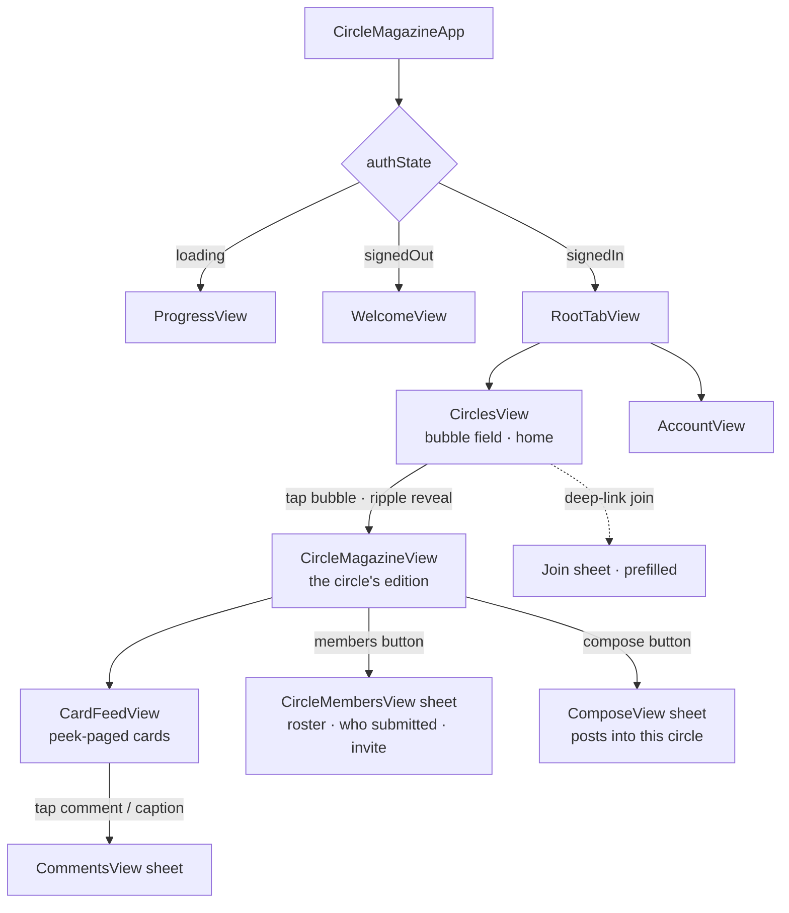
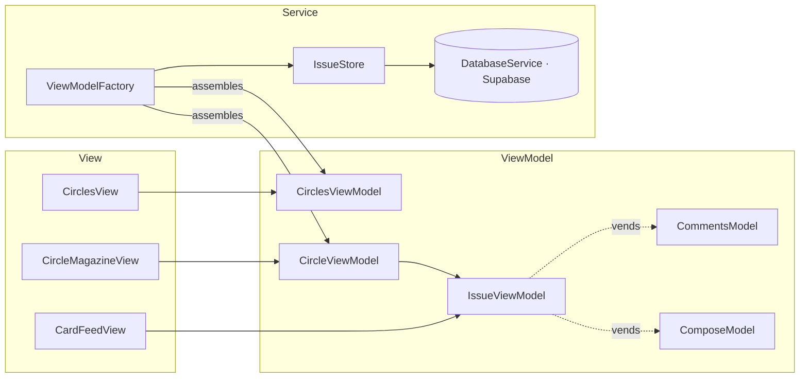

# Circle Magazine
The mission behind Cirlce is to make a social media application that doesn't suck. We're going to accomplish this in the following ways: 
1. Everything is limited. issues are released once a week on "Circle Sundays" and they contain a limited amount of content. Other limitations- you may only follow so many creators. you may only join so many circles. between tuesday - saturday, the app is not availible. go touch grass.
2. Content is valuable. no garbage, rage bait, softcore pornography, etc.
3. It allows you to stay up to date. by letting your friends submit to your magazine, you don't miss that your cousin got married.

# Software Design 
The database is hosted on Supabase, which has a beautiful swift framework that makes interacting with it a breeze. 

`IssueStore` and `AccountManager` wrap the database code, and reduce it to a few possible view states- for example, `IssueStore` has an @Observable enum with the cases `.loading, .loaded, .failedToLoad`. 
With associated values, we can include the Magazine data in the .loaded case like so- `.loaded(let magazine)`. `IssueStore` caches one of these per circle, keyed by circle id, so re-entering a circle is instant.

I really like this pattern because it reduces the complexity of the server to only a couple possible states for the view. 

From here, we use ViewModels to transform the data and inform the view. So the overall pattern is MVVM (my preferred iOS development pattern). Views never touch a service directly — the `ViewModelFactory` is the composition root: it owns the shared services (`IssueStore`, `DatabaseService`) and assembles a screen's ViewModel graph on demand, handing the view a ready-made ViewModel.

# App Flow

The magazine *is* the circle — there's no global feed. You land on your circles, tap into one, and read its edition. Compose lives inside a circle (you post into the edition you're viewing).

Under the hood, each view binds to a ViewModel, which the factory builds from the services:

# Setup 
You should be able to build and run by downloading the latest Xcode off the mac app store. Ask claude if you need more help. 

Thanks for reading!!! 
